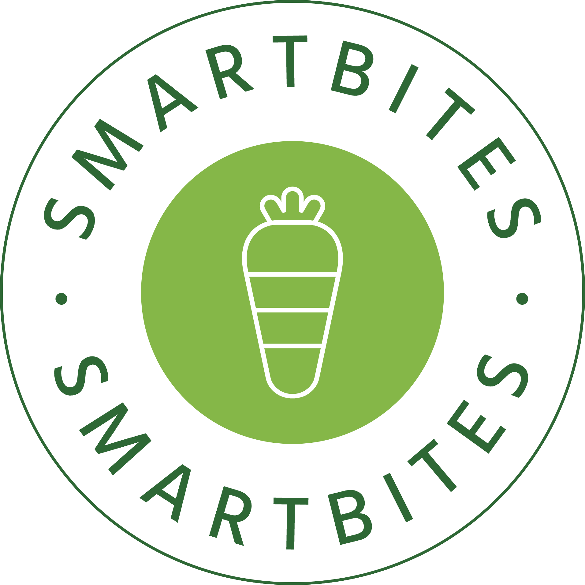

<!-- PROJECT SHIELDS -->
<!--
*** I'm using markdown "reference style" links for readability.
*** Reference links are enclosed in brackets [ ] instead of parentheses ( ).
*** See the bottom of this document for the declaration of the reference variables
*** for contributors-url, forks-url, etc. This is an optional, concise syntax you may use.
*** https://www.markdownguide.org/basic-syntax/#reference-style-links
-->

<!-- PROJECT LOGO -->
 

  

<h3 align="center">Smart Bites</h3>

<!-- TABLE OF CONTENTS -->

  
Table of Contents

  <ol>
    <li>
      <a href="#about-the-project">About The Project</a>
      <ul>
        <li><a href="#built-with">Built With</a></li>
      </ul>
    </li>
    <li><a href="#getting-started">Getting Started</a></li>
    <li><a href="#usage">Usage</a></li>
    <li><a href="#contact">Contact</a></li>
  </ol>

<!-- ABOUT THE PROJECT -->
## About The Project
Are you tired of struggling to make healthy choices when dining out? Do you wish there was an easy way to find nutritious options on a restaurant menu? Introducing Smart Bites, the revolutionary web app that takes a picture of a menu and provides you with personalized, healthy menu item recommendations. Regardless of your goals, allergies, and dietary restrictions, Smart Bites can help you on your journey to better health!

### Built With

* React
* Material UI
* Python
* Flask
* OpenAI API
* Google Cloud Vision API
* OCR

(<a href="#readme-top">back to top</a>)

## Inspiration
The inspiration for creating the web app "Smart Bites" stemmed from a very relatable and common challenge that many people face in their daily lives – maintaining a healthy diet while dining out. As we looked around, we noticed that there was a growing awareness of the importance of nutrition and fitness among individuals who were actively trying to make healthier choices or pursue bodybuilding goals.

However, one major obstacle stood in their way: the ambiguity of restaurant menus. Dining out often presented a dilemma, especially for those who were conscious about their calorie intake, macronutrient ratios, or specific dietary preferences. The menus at restaurants were extensive, filled with tempting options, but it was often a struggle to decipher which dishes aligned with their health and fitness goals.

This frustration led us to brainstorm a solution that could make the dining experience easier, more enjoyable, and conducive to personal health and fitness objectives. We envisioned a user-friendly web app that could bridge the gap between restaurant menus and individual dietary needs. 

"Smart Bites" was born out of this vision, and it became our mission to empower people to make smarter choices when dining out. The app leverages the power of technology, particularly image recognition and personalized recommendations, to provide a seamless experience. Users could simply take a photo of the menu, and "Smart Bites" would do the rest.

The core idea behind the app was to harness the vast amount of nutritional data and culinary knowledge available to us and use it to serve individuals better. Our goal was not only to help people find dishes that aligned with their dietary preferences but also to educate them about the nutritional content of their choices. We wanted to make eating out an informed, guilt-free experience, where individuals could pursue their fitness goals without compromising on flavor.

Ultimately, "Smart Bites" was created to be a trusted companion for anyone who wanted to enjoy dining out while staying on track with their healthy lifestyle or bodybuilding journey. By addressing this common pain point, we aimed to empower individuals to make more confident and informed choices, ultimately leading to better health and well-being.

(<a href="#readme-top">back to top</a>)

## Key Features
"Smart Bites" is a revolutionary web app designed to make dining out a healthier and more personalized experience. Here's an overview of what the app does:

Menu Photo Recognition: The core feature of "Smart Bites" is its ability to analyze and interpret restaurant menus. Users can simply take a photo of a menu using their smartphone's camera, and the app's powerful image recognition technology goes to work. It scans the menu to identify dishes, ingredients, and nutritional information.

Personalized Recommendations: Based on the menu analysis and the user's dietary preferences, health goals, and restrictions, "Smart Bites" generates personalized meal recommendations. These recommendations take into account factors such as calorie intake, macronutrient ratios, and specific diet plans (e.g., keto, vegetarian, vegan, low-carb).

Nutritional Insights: In addition to recommendations, the app provides detailed nutritional information for each dish on the menu. Users can easily see the calories, protein, carbohydrates, fats, and other essential nutrients for any item they're interested in. This empowers them to make informed choices that align with their nutritional needs.

Allergen Alerts: "Smart Bites" is sensitive to food allergies and intolerances. It alerts users to potential allergens present in dishes, ensuring their safety and peace of mind while dining out.

(<a href="#readme-top">back to top</a>)

## Difficulties Encountered
Image Recognition and OCR: Implementing accurate and robust image recognition and Optical Character Recognition (OCR) technology to extract text and identify menu items from photos was challenging. Ensuring that it works well across various lighting conditions, menu designs, and languages required significant testing. 

Menu Data Integration: Collecting and integrating menu data from different restaurants in a standardized format can be complex. Menus come in various layouts and structures, and developing algorithms to parse and categorize menu items correctly was challenging.

## Accomplishments
Working with Large Language Models (LLMs) and Optical Character Recognition (OCR) for the first time in the development of "Smart Bites" was a remarkable achievement. It positioned our project at the forefront of technological innovation in the realm of dining and health-conscious eating.

Our team's ability to master these cutting-edge technologies showcased our adaptability and commitment to staying ahead in the tech space. LLMs allowed us to provide personalized recommendations based on user preferences and health goals, enhancing the user experience significantly. OCR simplified menu input, enabling users to snap a photo instead of manually entering data.

This innovation not only improved user experience and data accuracy but also gave "Smart Bites" a competitive edge. We stood out as a leader in promoting healthier dining choices and catering to specific dietary needs. Positive user feedback reinforced the value of this accomplishment.

Moreover, our success with LLMs and OCR laid a solid foundation for future projects, demonstrating our capability to tackle complex tech challenges. In summary, integrating LLMs and OCR into "Smart Bites" was an achievement that transformed the dining experience, showcased our technical prowess, and positioned us as pioneers in health-conscious dining technology.

## Getting Started

[Demo]()

<!-- TEAM MEMBERS -->
## Contact
- Jason Tang
- Frank Liao
- Dylan Li
- Edward Wang

(<a href="#readme-top">back to top</a>)

<!-- MARKDOWN LINKS & IMAGES -->
<!-- https://www.markdownguide.org/basic-syntax/#reference-style-links -->
[contributors-shield]: https://img.shields.io/github/contributors/github_username/repo_name.svg?style=for-the-badge
[contributors-url]: https://github.com/github_username/repo_name/graphs/contributors
[forks-shield]: https://img.shields.io/github/forks/github_username/repo_name.svg?style=for-the-badge
[forks-url]: https://github.com/github_username/repo_name/network/members
[stars-shield]: https://img.shields.io/github/stars/github_username/repo_name.svg?style=for-the-badge
[stars-url]: https://github.com/github_username/repo_name/stargazers
[issues-shield]: https://img.shields.io/github/issues/github_username/repo_name.svg?style=for-the-badge
[issues-url]: https://github.com/github_username/repo_name/issues
[license-shield]: https://img.shields.io/github/license/github_username/repo_name.svg?style=for-the-badge
[license-url]: https://github.com/github_username/repo_name/blob/master/LICENSE.txt
[linkedin-shield]: https://img.shields.io/badge/-LinkedIn-black.svg?style=for-the-badge&logo=linkedin&colorB=555
[linkedin-url]: https://linkedin.com/in/linkedin_username
[product-screenshot]: project_management/readme_resources/intro.gif
[ai-gif]: project_management/readme_resources/aigenimage.gif
[copypaste-gif]: project_management/readme_resources/copypaste.gif
[Next.js]: https://img.shields.io/badge/next.js-000000?style=for-the-badge&logo=nextdotjs&logoColor=white
[Next-url]: https://nextjs.org/
[React.js]: https://img.shields.io/badge/React-20232A?style=for-the-badge&logo=react&logoColor=61DAFB
[React-url]: https://reactjs.org/
[Vue.js]: https://img.shields.io/badge/Vue.js-35495E?style=for-the-badge&logo=vuedotjs&logoColor=4FC08D
[Vue-url]: https://vuejs.org/
[Angular.io]: https://img.shields.io/badge/Angular-DD0031?style=for-the-badge&logo=angular&logoColor=white
[Angular-url]: https://angular.io/
[Svelte.dev]: https://img.shields.io/badge/Svelte-4A4A55?style=for-the-badge&logo=svelte&logoColor=FF3E00
[Svelte-url]: https://svelte.dev/
[Laravel.com]: https://img.shields.io/badge/Laravel-FF2D20?style=for-the-badge&logo=laravel&logoColor=white
[Laravel-url]: https://laravel.com
[Bootstrap.com]: https://img.shields.io/badge/Bootstrap-563D7C?style=for-the-badge&logo=bootstrap&logoColor=white
[Bootstrap-url]: https://getbootstrap.com
[JQuery.com]: https://img.shields.io/badge/jQuery-0769AD?style=for-the-badge&logo=jquery&logoColor=white
[JQuery-url]: https://jquery.com 
[Compose.com]: https://innovance.com.tr/wp-content/uploads/2022/01/Screen-Shot-2022-01-27-at-22.23.43.png
[Compose-url]: https://www.jetbrains.com/lp/compose-mpp/
